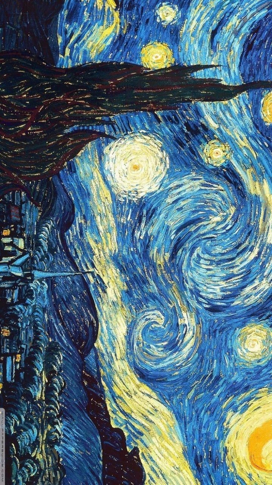

div>

# Hi, I'm Rahul Kumar! (@rahulkumargit1)

### GitHub Achievement Hunter & Full-Stack Developer
Welcome to my profile! I'm passionate about building clean, efficient code and exploring the latest GitHub features and badges.

---

### My GitHub Stats

### My Trophies

---

### Featured Project: Cryptocurrency Analysis Suite
| [**Crypto Analysis Suite**](https://github.com/rahulkumargit1/Cryptocurrency-Analysis-Suite) | A powerful platform providing real-time data and AI-driven price predictions. |   |ions. |   |

---

### Connect with me
[GitHub](https://github.com/rahulkumargit1)
